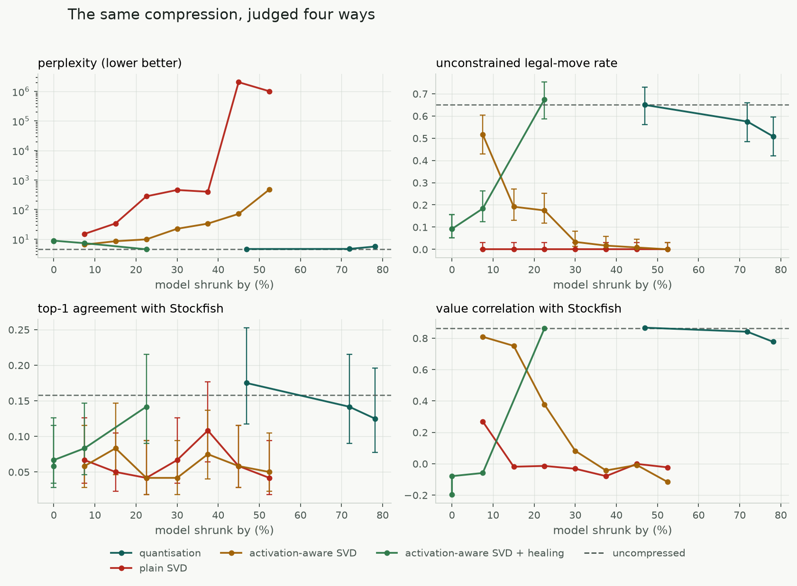

# ChessLM

A small language model taught to play chess, trained entirely on a laptop.

**Project page, with a replay of a real game and its search visible:** https://agcodin.github.io/chesslm/

**Play it on an Apple Silicon Mac:** `git clone https://github.com/agcodin/chesslm && cd chesslm && ./play.sh`

ChessLM fine-tunes Qwen2.5-1.5B with LoRA on Apple Silicon (MLX), then plays through a
PUCT tree search in which the same model supplies both the move candidates and a learned
evaluation of each position. A retrieval-augmented coach explains its moves, and a web board
lets you play against it.

**Headline:** learning from its own games cut ChessLM's blunder rate from 32% to about 27% of moves
(replicated), and it plays at roughly **1000 Elo** on a ladder anchored to Stockfish's calibrated
1320 setting. It does not yet beat that setting. Every number below is a real measurement, including
the experiments that failed and one prediction of mine that turned out wrong.

## How it works

1. **Data.** Stockfish plays itself with 15% random moves mixed in, so positions look like
   imperfect play. Every position is labelled with Stockfish's best move (depth 12) and its
   evaluation.
2. **Two tasks, one model.** Each position becomes two training examples:
   `FEN: … Best move:` → `e2e4`, and `FEN: … Eval:` → one of 21 letters `a`–`u`
   (the evaluation squashed with `tanh(cp/400)` into buckets). Because every bucket is a single
   token, one forward pass gives a full probability distribution over evaluations, and its mean
   is a smooth value in [-1, 1].
3. **Legal moves only, in one batch.** The model scores every legal move exactly: the position's KV
   cache is computed once and copied per candidate, so all moves are scored in one batched pass
   (13x faster than walking a prefix tree over move characters). It can never play an illegal move.
4. **Search.** PUCT (the AlphaZero selection rule) expands the model's top moves and scores
   leaves with the learned evaluation.
5. **Learning from its own games.** ChessLM plays 200 games; its search's choice in each position
   becomes the new training target (expert iteration, the AlphaZero idea), mixed with fresh
   Stockfish data so it doesn't forget.
6. **Coach.** Opening names come from an exact position lookup in the Lichess opening database.
   Chess principles are retrieved by vector search (bge-small embeddings) against facts computed
   from the move — captures, checks, forks, pins, hanging pieces — and the base model explains the
   move using only those facts.

## Results

### Playing strength

Rated on a ladder: a random mover, Stockfish limited to a one-ply search, Stockfish skill 0 and
Stockfish's calibrated `UCI_Elo 1320`, fitted jointly (Bradley-Terry) with a bootstrap 90% interval.
Blunder rate is the share of ChessLM's moves that lose at least 300 centipawns against Stockfish's
best move; over ~1,200 moves per run it is far more precise than a 30-game rating.

| Model (16 search simulations) | Elo [90% CI] | Blunder rate | Avg centipawn loss |
|---|---|---|---|
| Supervised on Stockfish data | 990 [851, 1147] | 32.1% | 297 |
| + DAgger (own positions, Stockfish labels) | 949 [823, 1091] | 30.6% | 279 |
| **+ expert iteration (own positions, own search labels)** | **1023 [888, 1181]** | **26.3%** | **240** |
| same model, independent re-rating | 1023 [888, 1181] | 27.3% | 249 |
| expert iteration, 2nd round | 990 [840, 1150] | 28.1% | 253 |

The ~5-point blunder reduction is several standard errors and replicated; the Elo differences are
within their intervals.

### Move and value accuracy

Move accuracy is top-1 agreement with Stockfish on a fixed set of held-out positions. Value
correlation is between the model's evaluation and Stockfish's.

| Model | Move accuracy | Value correlation |
|---|---|---|
| Qwen2.5-1.5B, untrained | 6.5% | — |
| Moves only, 64k examples | 11.75% | — |
| Moves + value, 50/50 data mix | 9.0% | 0.797 |
| **Moves + value, value rows thinned to 35%** | **12.67%** | **0.867** |

What the experiments showed:

- **Prompt length mattered more than model size.** The first prompt listed every legal move
  (~450 tokens); training was so slow that one run saw only 28% of the data once. A
  position-only prompt (~60 tokens) fixed it — the search enforces legality anyway.
- **A bigger model was not better.** Qwen2.5-3B (4-bit) scored 9.5% against the 1.5B's 9.75%
  on identical data, while training about 3x slower.
- **Adding a value head initially hurt move choice.** A 50/50 mix of move and value examples
  dropped move accuracy from 11.75% to 9.0%. Keeping only 20–35% of the value examples recovered
  it and beat the move-only record, so one model can learn both if the mix is right.
- **Copying its own search beat copying Stockfish, and I predicted the opposite.** ChessLM's search
  agreed with Stockfish in only 17% of its own positions, so I expected training on those choices
  to make it worse. Move accuracy did fall (13.3% to 11.3%), but blunders dropped sharply: the
  search's disagreements are mostly rejections of moves its lookahead shows to be losing. At this
  level, not blundering matters far more than finding the exact best move, and move accuracy was
  the wrong metric to judge it by.
- **Better evaluation is not automatically better search.** Before expert iteration, a plain
  material count beat the learned evaluation inside the search (29.0% vs 32.1% blunders). After
  it, the learned evaluation won clearly (26.3% vs 33.5% for a learned/material blend), plausibly
  because the policy was trained to agree with a search that used it.
- **A second round did not add more** (28.1%, within noise of round 1, with half the positions).
- **Compression did not speed it up.** 8-bit and 4-bit versions were no faster at 1.5B parameters
  (the model is not memory-bandwidth-bound at this size) and 4-bit lost accuracy.
- **Not yet winning against Stockfish's 1320 setting**: one draw in 30 games across all versions.
## Compressing it

Compression results are almost always reported as perplexity: shrink the model, show that
perplexity barely moved, claim the capability survived. Perplexity averages over every token, so a
model can keep its fluency — the grammar, the common words, the shape of the output — while losing
the narrow skill it was actually trained for. Everyone knows this is a weakness. It is hard to
demonstrate because "capability" on general benchmarks is noisy and contaminated.

A chess model makes it measurable. There is a ground truth that cannot be bluffed, so the same
compressed model can be scored on four axes at once, ordered from surface competence to real skill:

| axis | what it asks |
|---|---|
| **perplexity** | the usual metric: token-level loss on held-out move completions |
| **legal-move rate** | decode freely, with the legality trie switched off: is the output even a legal move? |
| **top-1 agreement** | with legality enforced, does it pick Stockfish's move? |
| **value correlation** | does its learned evaluation still track Stockfish's? |

The claim worth testing is that these do not fall together.



### What happened

**Quantisation is nearly free, and is the baseline to beat.** 8-bit is indistinguishable from the
original on all four axes. 4-bit was re-measured on 800 positions rather than 120 to tighten the
intervals, and it holds up: perplexity rises 0.4%, the legal-move rate is unchanged at 57.8%, value
correlation goes 0.865 to 0.843, and the top-1 gap (15.5% to 13.5%) sits inside its own confidence
interval. For 0.87 GB against 3.09 GB, that is effectively lossless, and nothing else here comes
close to the trade.

It is worth saying plainly that this cuts against the result I went looking for. I expected 4-bit
to show the divergence too. It does not — the metrics agree with each other, because the model
really is intact. The divergence below belongs to rank truncation specifically, not to compression
in general.

**Low-rank factorisation without repair is catastrophic, far earlier than expected.** Truncating
the MLP projections by rank — the family of methods behind "quantum-inspired" tensor-network
compression — destroys the model at ratios that sound harmless. Removing just 7% of the parameters
raises perplexity 3.2x and takes the unconstrained legal-move rate from 65% to **zero**. Not
degraded: the model stops emitting legal chess moves at all. Plain SVD minimises error in the
weights, which is simply the wrong objective.

**Calibrating on real activations is worth one to two orders of magnitude.** Weighting the
factorisation by how strongly each input channel actually fires on chess positions, then unscaling
— ASVD, calibrated in-domain — changes the same 23%-smaller model from perplexity 280.6 to 9.8. It
is the difference between rubble and something recognisable, and it costs 32 forward passes.

**The divergence is real, and legality is where it shows.** At 15% smaller with activation-aware
SVD, perplexity is 1.83x — a number you could talk yourself into shipping — and value correlation
still retains 87% of the original. The legal-move rate has fallen from 65% to 19%, with
non-overlapping Wilson intervals. Two of the four metrics say the model is fine. The model cannot
reliably produce a legal chess move.

That is the whole argument in one row. A compression method reporting only perplexity here would
report a mild, acceptable cost.

### Healing is the whole game

Everything above describes factorised models that were never repaired. Truncation throws away
directions in weight space and the surviving parameters have never been asked to compensate;
healing gives them a few thousand steps to do it, with LoRA adapters that are folded back into the
factors afterwards, so the model keeps exactly the size it had.

At 400 steps this did almost nothing — 1,600 examples against the 64,000 the original adapter saw.
At 3,000 steps and batch 8 it changes the conclusion completely. Measured on 800 positions:

| | uncompressed | factorised, 23% smaller | after healing |
|---|---|---|---|
| perplexity | 4.64 | 9.84 | **4.53** |
| legal-move rate | 57.8% [54.3–61.1] | 17.5% | **63.2% [59.9–66.5]** |
| top-1 agreement | 15.5% [13.2–18.2] | 4.2% | 11.9% [9.8–14.3] |
| value correlation | 0.865 | 0.377 | **0.848** |

A model with 23% of its parameters removed matches the original on perplexity and value
correlation and is not distinguishable from it on the legal-move rate. Top-1 agreement retains 77%,
and even that gap sits inside its own interval. So rank truncation is survivable at this ratio —
but only if you pay for the repair, which is the part the headline compression numbers tend to
leave out.

**An anomaly I have not resolved.** The *less* aggressive setting healed *worse*. At 7.5% smaller,
healing left the model at perplexity 7.30 with a legal-move rate of 18%, which is worse than the
same model before healing (6.54). Identical hyperparameters, same seed, same step count; the only
structural difference is that its rank sits closer to the break-even point. Either that run hit an
instability, or something in the factorisation degrades at high rank. One sample per setting cannot
tell those apart, so it is recorded here as an open question rather than smoothed into the trend.

### What did not work, and what this does not show

- **Top-1 agreement is too noisy to carry the claim, and I expected it to be the headline.** The
  test set gives a Wilson interval of roughly ±5 points at n=120 and ±2.5 at n=800, against a
  baseline of only 15.5%, and the legality trie puts a floor of about 4–6% under even a destroyed
  model. The dynamic range is too small. Legality and value correlation do the work instead. Every
  proportion in `runs/compress/table.md` carries its interval, and the ones that are noise are
  labelled as noise.
- **This is one model on one task.** A 1.5B model fine-tuned for a narrow skill is exactly the case
  where compression should hurt most: there is less redundancy to give up than in a general model.
  The direction of the effect should generalise; the magnitudes should not be assumed to.
- **No claim to beat quantisation.** It doesn't. The healed model recovers its quality but is
  still 2.4 GB in fp16 against 0.87 GB for 4-bit, which loses nothing measurable here. Removing
  parameters and lowering precision are complementary — the healed factorisation could be
  quantised on top, and that combination is the obvious next experiment — but on its own,
  factorisation is the worse deal. The point of the study is what the metrics hide, not a new
  state of the art.

### Reproducing it

```bash
./compress_run.sh
```

Roughly two to three hours on an M-series Mac. Stages run as separate processes because MLX holds
GPU memory for the life of a process, and running an eval next to training has OOM'd this machine.
Results land in `runs/compress/` as JSON lines, figures in `docs/figures/`.

## Running it

Requires an Apple Silicon Mac, [uv](https://docs.astral.sh/uv/) and Stockfish.

```bash
brew install stockfish uv
uv sync
```

Fetch the opening database for the coach (CC0, from lichess-org/chess-openings):

```bash
for f in a b c d e; do curl -sfL https://raw.githubusercontent.com/lichess-org/chess-openings/master/$f.tsv -o kb/$f.tsv; done
```

Generate data and train (about 2 minutes and 45 minutes respectively on an M5 Pro):

```bash
mkdir -p data_v3
uv run gen_data.py 14 500 data_v3
uv run mlx_lm.lora --model Qwen/Qwen2.5-1.5B-Instruct --train --data data_v3 --iters 2000 \
  --batch-size 32 --num-layers 16 --learning-rate 7e-5 --mask-prompt --adapter-path adapters_best
```

Merge the adapter (full precision is fastest; see results) and point `models/best` at it:

```bash
uv run mlx_lm.fuse --model Qwen/Qwen2.5-1.5B-Instruct --adapter-path adapters_best --save-path models/fused_bf16
ln -sfn fused_bf16 models/best
```

Learn from its own games, rate, and play:

```bash
./selfplay_round.sh search sp_expert 200
uv run rating.py --model models/sp_expert --games 10 --sims 16
uv run uvicorn server:app --port 8000
```

`phase3.sh` is the unattended loop used for the supervised results: it generates fresh data, trains
with varying hyperparameters and data mixes, and promotes a model only if move accuracy holds and
move or value quality improves. `NOTES.md` is the full lab notebook.

## Files

| File | Purpose |
|---|---|
| `gen_data.py` | Stockfish self-play → move and value training examples |
| `common.py` | Prompt formats and value buckets |
| `engine.py` | Batched move scoring, learned value, PUCT search |
| `selfplay_data.py`, `selfplay_round.sh` | Positions from its own games, labelled by Stockfish or its own search; one full train-and-rate round |
| `rating.py` | Elo ladder, bootstrap interval, blunder rate |
| `play.sh`, `weights/` | One-command local launcher; the trained 21 MB LoRA adapter |
| `record_game.py`, `docs/` | Annotated game recorder; the project page (`python3 docs/build.py`), served by GitHub Pages |
| `coach.py` | Opening lookup, move facts, vector retrieval, explanations |
| `server.py`, `web/` | FastAPI backend and the playable board |
| `eval_acc.py`, `eval_value.py`, `play.py` | Move accuracy, value correlation, games vs Stockfish |
| `phase3.sh` | Unattended train / evaluate / promote loop |
| `compress.py` | Low-rank factorisation of the MLP projections, activation-aware calibration, save/load |
| `eval_compress.py` | The four-axis evaluation: perplexity, legality, top-1, value correlation |
| `sweep.py`, `sensitivity.py` | Compression arms across ratios; per-layer damage profile |
| `heal.py` | Post-factorisation LoRA finetune, folded back into the factors |
| `report.py`, `figures.py`, `compress_run.sh` | Wilson intervals and tables, the figures, the full rerun |

## Credits

Chess piece images: the cburnett set from [Lichess](https://github.com/lichess-org/lila),
licensed CC BY-SA 3.0. Opening names: [lichess-org/chess-openings](https://github.com/lichess-org/chess-openings) (CC0).
Base model: [Qwen2.5-1.5B-Instruct](https://huggingface.co/Qwen/Qwen2.5-1.5B-Instruct).
